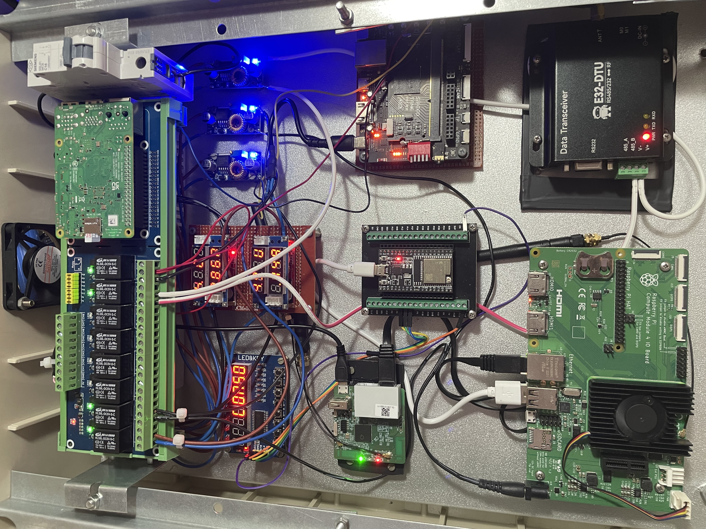

Sure! Below is a sample README file for your GitHub project related to a home automation system with Raspberry Pi and relay system. The file also includes the necessary markdown to display the image you mentioned, "temel.jpeg":

---

# Home Automation System with Raspberry Pi and Relay Module

This project is a home automation system built using a **Raspberry Pi** and a **Relay Module**. The goal is to control household appliances (such as lights, fans, etc.) remotely via a web interface or a custom app. The system makes use of the GPIO pins on the Raspberry Pi to interface with the relay module, allowing you to control the connected devices.



## Features

- **Web-based Control**: Control appliances through a user-friendly web interface.
- **GPIO Control**: Directly interacts with the GPIO pins on the Raspberry Pi for controlling relays.
- **Relay Module**: Allows the control of high-voltage devices using low-voltage signals from the Raspberry Pi.
- **Mobile Support**: Access and control the system from your mobile device or any device with a web browser.

## Hardware Requirements

- **Raspberry Pi** (Any model with GPIO support, e.g., Raspberry Pi 3/4)
- **Relay Module** (1 or more, depending on the number of devices you wish to control)
- **Jumper wires**
- **Breadboard** (Optional)
- **External devices** (Lights, Fans, etc. connected via relays)

## Software Requirements

- **Raspberry Pi OS** (or any Linux-based OS on the Raspberry Pi)
- **Python** (3.x)
- **Flask** (for web server)
- **RPi.GPIO** (Python library to interact with Raspberry Pi GPIO pins)

## Setup Instructions

### 1. Set up Raspberry Pi

- Install Raspberry Pi OS on your Raspberry Pi.
- Ensure your Raspberry Pi is connected to the internet and updated:

  ```bash
  sudo apt update
  sudo apt upgrade
  ```

### 2. Install Required Libraries

- Install Python 3 and the necessary libraries:

  ```bash
  sudo apt install python3-pip
  sudo pip3 install flask RPi.GPIO
  ```

### 3. Connect the Relay Module

- Connect the relay module to the Raspberry Pi GPIO pins. Refer to the **Relay Module** datasheet or pinout diagram for correct wiring.

  - **VCC** → 5V (on Raspberry Pi)
  - **GND** → GND (on Raspberry Pi)
  - **IN1, IN2, IN3, IN4** → GPIO pins (for controlling individual relays)

### 4. Clone the Repository

- Clone the project repository to your Raspberry Pi:

  ```bash
  git clone https://github.com/your-username/home-automation.git
  cd home-automation
  ```

### 5. Run the Flask Server

- Start the Flask server:

  ```bash
  python3 app.py
  ```

- The server should now be running locally. You can access the control interface by navigating to:

  ```
  http://<your-pi-ip>:5000
  ```

### 6. Accessing the Web Interface

- Open any web browser on your local network, and go to the IP address of your Raspberry Pi (e.g., `http://192.168.x.x:5000`).
- From here, you can control the connected appliances by toggling the switches on the web interface.

## Usage

1. Open the web interface using the Raspberry Pi's IP address and port.
2. Click on the buttons to turn devices on or off.
3. You can add additional relays by modifying the code to control more GPIO pins and adding corresponding buttons to the UI.

## Safety Notes

- **Electrical safety**: Ensure that you handle high-voltage connections carefully. Always disconnect power before wiring the relay and external devices.
- **Relay Module**: If you plan to control high-power appliances, make sure your relay module can handle the voltage and current ratings of the devices.

## Example Circuit Diagram


---

### Notes:

- Replace `your-username` with your actual GitHub username.
- Ensure that `temel.jpeg` is in the same directory as this `README.md` file, or specify the correct path to the image if it is stored in a subdirectory.
